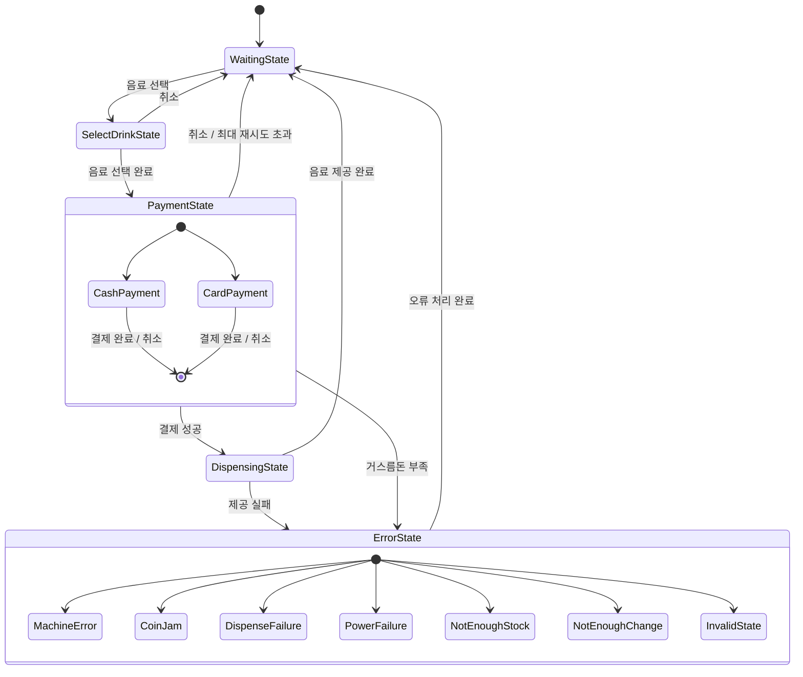

# protopie-vending-machine

이 프로젝트는 TypeScript로 구현된 OOP 스타일의 자판기 시뮬레이터입니다.
상태 패턴을 사용하여 자판기의 주요 상태와 동작을 모델링했습니다.

## 개발 환경

- TypeScript: 4.2.2
- Node.js: v22
- OS: macOS (Apple Silicon)

## 실행 방법

1. Node.js 버전이 22 이상인지 확인하세요.
2. 프로젝트 루트 디렉토리에서 다음 명령어를 실행하세요:
   ```
   npm install
   npm run start
   ```

## State 다이어그램



## 사용 방법

1. 프로그램을 실행하면 자판기 시뮬레이터가 시작됩니다.
2. 화면의 지시에 따라 음료를 선택하고 결제를 진행하세요.
3. 현금 결제 시 "금액:개수" 형식으로 입력하세요. (예: "1000:1, 500:2")
4. 카드 결제는 자동으로 시뮬레이션됩니다.(20% 실패 확률 존재)
5. 언제든 "취소"를 입력하여 현재 작업을 취소할 수 있습니다.
6. "종료"를 입력하면 프로그램이 종료됩니다.

## 구현 특이사항

- 상태 패턴을 사용하여 자판기의 다양한 상태와 전환을 관리합니다.
- 현금 처리 시 화폐 단위별로 구분하여 입력받고 관리합니다.
- 거스름돈 계산 시 실제 보유한 화폐를 고려합니다.
- 비동기(setTimeout) 처리를 통해 결제 및 음료 제공 과정을 단순화하여 시뮬레이션합니다.
- 다양한 오류 상황(현금 투입구에 문제가 있는 경우, 동전 걸림 등)을 시뮬레이션합니다.
  - 현재 현금 투입구에 문제가 있는 경우만 구현한 상태입니다.
  - 동일한 범주로 엮을 수 있는 다른 케이스들도 동일한 패턴으로 구현 예정입니다.

## 카드 거래 테스트 케이스

1. 정상적인 거래:
   1. 음료 >> 콜라(1,100원) >> 카드 입력
   2. 예상 결과: 20% 확률로 재결제 요청

## 현금 거래 테스트 케이스

1. 정상적인 거스름돈 반환:
   1. VendingMachine.ts에서 cashInventory의 모든 화폐 단위를 50으로 설정
   2. 음료 >> 콜라(1,100원) >> 현금 >> "1000:1, 500:1" 입력
   3. 예상 결과: 400원 거스름돈 반환
2. 큰 금액의 거스름돈:
   1. VendingMachine.ts에서 cashInventory의 모든 화폐 단위를 50으로 설정
   2. 음료 >> 물(600원) >> 현금 >> "5000:1" 입력
   3. 예상 결과: 4,400원 거스름돈 반환
3. 거스름돈 부족 상황:
   1. VendingMachine.ts에서 cashInventory의 100원 동전을 1, 500원 동전을 0으로 설정
   2. 음료 >> 커피(700원) >> 현금 >> "1000:1" 입력
   3. 예상 결과: 거스름돈 반환 불가 메시지 표시
4. 동전 고갈 상황:
   1. VendingMachine.ts에서 cashInventory의 100원, 500원 동전을 0으로 설정
   2. 음료 >> 물(600원) >> 현금 >> "1000:1" 입력
   3. 예상 결과: 거스름돈 반환 불가 메시지 표시
5. 투입 금액 부족:
   1. 음료 >> 콜라(1,100원) >> 현금 >> "500:2" 입력
   2. 예상 결과: 현재 투입 금액, 금액을 투입하세요 메시지 표시, 100:1 추가 입력하면 음료 제공
6. 취소 및 반환:
   1. 음료 >> 커피(700원) >> 현금 >> "500:1" >> "취소" 입력
   2. 예상 결과: 500원 반환 메시지 표시
7. 연속 거래:
   1. 물(600원) 구매 완료 후 콜라(1,100원) 구매
   2. 예상 결과: 두 거래 모두 정상 처리
8. 대량의 동전 투입:
   1. 음료 >> 콜라(1,100원) >> 현금 >> "100:11" 입력
   2. 예상 결과: 정상 처리 및 음료 제공

## 공통 테스트 케이스

1. 재고 부족:
   1. VendingMachine.ts에서 특정 음료의 재고를 0으로 설정, 또는 연속 거래해 재고를 0으로 만듦
   2. 예상 결과: 남은 재고 0개 표시 이후 해당 음료 표시 안됨
2. 잘못된 금액 입력:
   1. 100원 / 500원 / 1,000원 / 5,000원 / 10,000원권 외의 현금을 입력하는 경우
   2. 입력 형식을 맞추지 않은 경우
   3. 최대 투입 금액 10,000원을 초과해서 입력하는 경우
   4. 예상 결과: 경고 메시지 표시 및 3회 이상 초과 시 최초 대기 상태로 이동
3. 예외적으로 발생하는 기계 오류:
   1. VendingMachine.ts에서 cashSlotWorking의 값을 false로 변경
   2. 예상 결과: 해당 상황에 맞는 경고메시지 출력

## 향후 개선 사항

- 단위 테스트 및 통합 테스트 추가
- 관리자 모드 구현 (재고 관리, 매출 확인 등)
- GUI 인터페이스 추가
