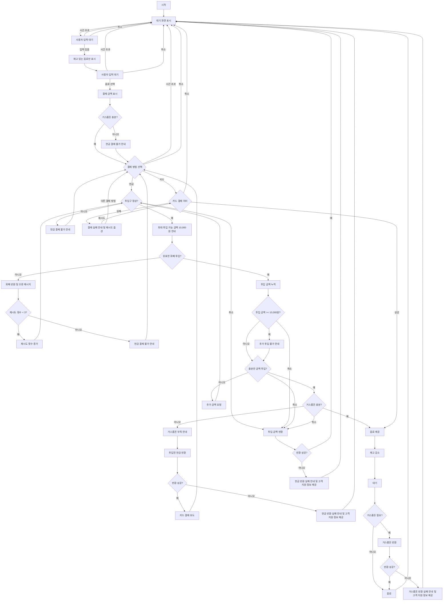

```mermaid
graph TD
    A[시작] --> B[대기 화면 표시]
    B --> C[사용자 입력 대기]
    C --> |입력 있음| E[재고 있는 음료만 표시]
    C --> |시간 초과| B
    E --> G[사용자 입력 대기]
    G --> |음료 선택| GB[결제 금액 표시]
    G --> |시간 초과| B
    GB --> GD{거스름돈 충분?}
    GD --> |예| H{결제 방법 선택}
    GD --> |아니오| GE[현금 결제 불가 안내]
    GE --> H
    H --> |현금| K{투입구 정상?}
    H --> |카드| L{카드 결제 처리}
    H --> |시간 초과| B
    K --> |예| KA[최대 투입 가능 금액 10,000원 안내]
    K --> |아니오| N[현금 결제 불가 안내]
    KA --> M{유효한 화폐 투입?}
    M --> |예| MA[투입 금액 누적]
    M --> |아니오| MB[화폐 반환 및 오류 메시지]
    MA --> O{투입 금액 >= 10,000원?}
    MB --> MC{재시도 횟수 < 3?}
    MC --> |예| MD[재시도 횟수 증가]
    MC --> |아니오| ME[현금 결제 불가 안내]
    MD --> K
    ME --> H
    O --> |아니오| Q{충분한 금액 투입?}
    O --> |예| R[추가 투입 불가 안내]
    R --> Q
    Q --> |예| S{거스름돈 충분?}
    Q --> |아니오| T[추가 금액 요청]
    T --> K
    S --> |예| U[음료 제공]
    S --> |아니오| SE[거스름돈 부족 안내]
    SE --> SF[투입된 현금 반환]
    SF --> SG{반환 성공?}
    SG --> |예| SH[카드 결제 유도]
    SG --> |아니오| SI[현금 반환 실패 안내 및 고객 지원 정보 제공]
    SH --> H
    SI --> B
    L --> |성공| U
    L --> |실패| W[결제 실패 안내 및 재시도 옵션]
    U --> X[재고 감소]
    X --> AA[대기]
    AA --> AB{거스름돈 필요?}
    AB --> |예| AC[거스름돈 반환]
    AB --> |아니오| AD[종료]
    AC --> ACA{반환 성공?}
    ACA --> |예| AD
    ACA --> |아니오| ACB[거스름돈 반환 실패 안내 및 고객 지원 정보 제공]
    ACB --> B
    N --> H
    W --> |재시도| L
    W --> |다른 결제 방법| H
    AD --> B

    %% 결제 취소 옵션 추가
    C --> |취소| B
    G --> |취소| B
    H --> |취소| B
    K --> |취소| BV[투입 금액 반환]
    O --> |취소| BV
    Q --> |취소| BV
    S --> |취소| BV
    L --> |취소| B
    BV --> BVA{반환 성공?}
    BVA --> |예| B
    BVA --> |아니오| BVB[현금 반환 실패 안내 및 고객 지원 정보 제공]
    BVB --> B
```
